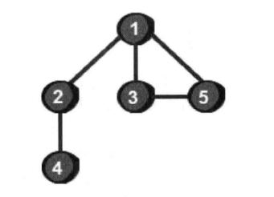
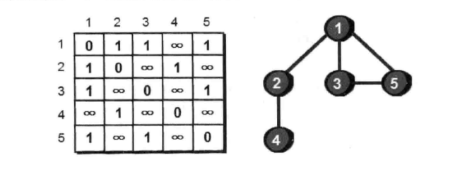
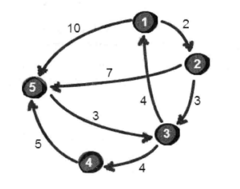
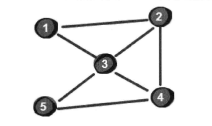

### 第一节 深度和广度优先究竟指啥

深度和广度的概念，还是源于对【图】的遍历而言



通常使用一个二维数组存储图的状态



> 深度优先的思路： 首先以一个未访问的顶点作为起始顶点，沿当前顶点的边访问到下一个未访问过的顶点，继续沿着这条分支遍历下去，直到末端；然后返回上一个顶点，通过这个顶点的其他边访问下一个未访问的顶点；直到所有的顶点都被访问过。代码实现如下：

```js
var map = [
  [0, 1, 1, null, 1],
  [1, 0, null, 1, null],
  [1, null, 0, null, 1],
  [null, 1, null, 0, null],
  [1, null, 1, null, 0],
]
let n = 5
var path = [1]
var book = []
for (let i = 0; i < n; i++) {
  book.push(0)
}
book[0] = 1
// 当前图有个特色，就是沿右下对角线对称
var dfs = (index) => {
  for (let i = 0; i < n; i++) {
    if (book[i] === 0 && map[index][i]) {
      path.push(i + 1)
      book[i] = 1
      book[i] = 1
      dfs(i)
    }
  }
}
dfs(0)
console.warn(path)
```

还可以增加一个 sum 参数记录标记过的数量，提早结束不必要的循环。

> 换成广度优先搜索来遍历这个图，

```js
var map = [
  [0, 1, 1, null, 1],
  [1, 0, null, 1, null],
  [1, null, 0, null, 1],
  [null, 1, null, 0, null],
  [1, null, 1, null, 0],
]
let n = 5
var list = [0]
var book = []
for (let i = 0; i < n; i++) {
  book.push(0)
}
book[0] = 1
var start = 0
var next = 1
// 当前图有个特色，就是沿右下对角线对称
while (start < next) {
  let index = list[start]
  for (let i = 0; i < n; i++) {
    if (book[i] === 0 && map[index][i]) {
      list.push(i)
      book[i] = 1
      next++
    }
    if (next > n) {
      break
    }
  }
  start++
}
console.warn(list)
```

### 第二节 城市地图--图的深度优先遍历

> 场景： 暑期，小哈想去小哼家玩耍，两人住在不同的城市；下面是城市图，如何仿照百度地图给出最短最优路线图呢？



当前假设有 5 个城市，8 条公路。小哼在 1 号城市，小哈在 5 号城市，求 1 号城市到 5 号的最短路程（即最短路径）。

```js
var map = [
  [0, 2, null, null, 10],
  [null, 0, 3, null, 7],
  [4, null, 0, 4, null],
  [null, null, null, 0, 5],
  [null, null, 3, null, 0],
]
let n = 5
var start = 0
var target = 4

var book = []
let result = [] // 存储所有从1号城市出发到底的城市最短路径
for (let i = 0; i < 5; i++) {
  result.push(999)
  book.push(0)
}
result[0] = 0
book[0] = 1

// 采用深度遍历写写
var dfs = (deep, s) => {
  if (deep === target) {
    console.warn('计算出了1-5号的其中一条路径', s)
    return
  }
  for (let i = 0; i < n; i++) {
    let len = map[deep][i]
    if (len && book[i] === 0) {
      book[i] = 1
      result[i] = Math.min(result[i], s + len)
      dfs(i, s + len)
      book[i] = 0
    }
  }
}
dfs(start, 0)
console.log('result', result)
console.warn('1号到5号的最短路径为：', result[target]) // 9
```

> 场景稍加修改，如果 5 个城市之间从原本的有向图改成无向图，即公路是可以双向通车的。那么最短路径就变了。代码的时候注意地图初始化的值

```js
var map = [
  [0, 2, 4, null, 10],
  [2, 0, 3, null, 7],
  [4, 3, 0, 4, 3],
  [null, null, 4, 0, 5],
  [null, 7, 3, 5, 0],
]
let n = 5
var start = 0
var target = 4

var book = []
let result = [] // 存储所有从1号城市出发到底的城市最短路径
for (let i = 0; i < n; i++) {
  result.push(999)
  book.push(0)
}
result[0] = 0
book[0] = 1

// 采用深度遍历写写
var dfs = (deep, s) => {
  if (deep === target) {
    console.warn('计算出了1-5号的其中一条路径', s)
    return
  }
  for (let i = 0; i < n; i++) {
    let len = map[deep][i]
    if (len && book[i] === 0) {
      book[i] = 1
      result[i] = Math.min(result[i], s + len)
      dfs(i, s + len)
      book[i] = 0
    }
  }
}
dfs(start, 0)
console.log('result', result)
console.warn('1号到5号的最短路径为：', result[target]) // 7
```

本节使用了二维数组存储图（顶点和边的关系），这种存储方法叫**图的邻接矩阵表示法**，存储图的方式还有很多，如接下来要讲解的邻接表。

### 第三节 最少转机-图的广度优先遍历

> 场景： 从上一节中小哼和小哈相遇了，计划要一同去旅游，目前他们都在 1 号城市，目标去 5 号城市，可是 1-5 之间没有直达的航班，小哼希望找到一种乘坐方式，能转机次数最少。

假设 5 个城市，7 条航线



```js
var map = [
  [0, 1, 1, null, null],
  [1, 0, 1, 1, null],
  [1, 1, 0, 1, 1],
  [null, 1, 1, 0, 1],
  [null, null, 1, 1, 0],
]
var n = 5
var list = [] // 标记所有点到达的转线次数
var start = 0
var next = 1

var book = [] // 标记走过的城市，避免路线死循环
for (let i = 0; i < n; i++) {
  book.push(0)
}

book[0] = 1
list.push({
  index: 0,
  step: 0,
})
var flag = 0
while (start < next) {
  let row = list[start].index
  for (let i = 0; i < n; i++) {
    if (map[row][i] && book[i] === 0) {
      book[i] = 1
      if (i === n - 1) {
        console.warn('找到1-5转机最少的次数', list[start].step + 1)
        flag = 1
        break
      }
      next++
      list.push({
        index: i,
        step: list[start].step + 1,
      })
    }
  }
  if (flag) {
    break
  }
  start++
}
```

> 改成深度遍历试一下，不过这种类型的题，广度搜索会更快

```js
var map = [
  [0, 1, 1, null, null],
  [1, 0, 1, 1, null],
  [1, 1, 0, 1, 1],
  [null, 1, 1, 0, 1],
  [null, null, 1, 1, 0],
]
var n = 5
var minStep = 999

var book = [] // 标记走过的城市，避免路线死循环
for (let i = 0; i < n; i++) {
  book.push(0)
}

book[0] = 1

var dfs = (index, len) => {
  if (index === n - 1) {
    minStep = Math.min(minStep, len)
    return
  }
  for (let i = 0; i < n; i++) {
    if (map[index][i] && book[i] === 0) {
      book[i] = 1
      dfs(i, len + 1)
      book[i] = 0
    }
  }
}
dfs(0, 0)
console.warn('到达5号城市的最少转机次', minStep)
```
