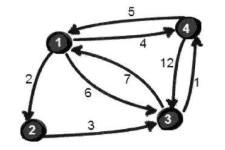
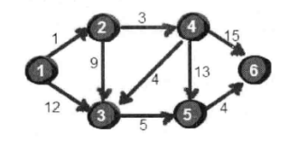

### 第一节 只有五行的算法--Floyd-Warshall

**[多源最短路径问题]**

例题： n 座城市之间存在单向路径长度（有些城市间有公路，有些无），小哼要进行城市间的旅游，计算任意两座城市之间的**最短路径**



如果两点之间 ，通过第三个点进行转折，反而路程更短；那么选择哪个点，中途增加几个点呢。

这里先假设只通过 1 号顶点做中转点，求任意两点的最短路径。

```javascript
var obj = [
  [0, 2, 6, 4],
  [null, 0, 3, null],
  [7, null, 0, 1],
  [5, null, 12, 0],
]
var n = 4
// 核心5行代码
for (let i = 0; i < n; i++) {
  for (let j = 0; j < n; j++) {
    if (obj[i][0] && obj[0][j] && i !== j) {
      obj[i][j] = obj[i][j]
        ? Math.min(obj[i][0] + obj[0][j], obj[i][j])
        : obj[i][0] + obj[0][j]
    }
  }
}
console.dir(obj)
```

接下来假设能经过 1、2 两个点，算出来的最短路径是？

```javascript
var obj = [
  [0, 2, 6, 4],
  [null, 0, 3, null],
  [7, null, 0, 1],
  [5, null, 12, 0],
]
var n = 4

// 经过1号顶点
for (let i = 0; i < n; i++) {
  for (let j = 0; j < n; j++) {
    if (obj[i][0] && obj[0][j] && i !== j) {
      obj[i][j] = obj[i][j]
        ? Math.min(obj[i][0] + obj[0][j], obj[i][j])
        : obj[i][0] + obj[0][j]
    }
  }
}

// 经过2号顶点
for (let i = 0; i < n; i++) {
  for (let j = 0; j < n; j++) {
    if (obj[i][1] && obj[1][j] && i !== j) {
      obj[i][j] = obj[i][j]
        ? Math.min(obj[i][1] + obj[1][j], obj[i][j])
        : obj[i][1] + obj[1][j]
    }
  }
}
console.dir(obj)
```

当允许经过 1、2、3 号点

```javascript
var obj = [
  [0, 2, 6, 4],
  [null, 0, 3, null],
  [7, null, 0, 1],
  [5, null, 12, 0],
]
var n = 4
var fs = (target) => {
  // 经过target号顶点
  for (let i = 0; i < n; i++) {
    for (let j = 0; j < n; j++) {
      if (obj[i][target] && obj[target][j] && i !== j) {
        obj[i][j] = obj[i][j]
          ? Math.min(obj[i][target] + obj[target][j], obj[i][j])
          : obj[i][target] + obj[target][j]
      }
    }
  }
}

fs(0)
fs(1)
fs(2)
console.dir(obj)
```

> 概括：从 i 号顶点到 j 号顶点只经过前 k 号点的最短路径。其实就是一种动态规划的思想

整个步骤虽然很麻烦，但是代码实现却很简单，核心代码如下

```js
let n = 4
var fs = (target) => {
  // 经过target号顶点
  for (let i = 0; i < n; i++) {
    for (let j = 0; j < n; j++) {
      if (obj[i][target] && obj[target][j] && i !== j) {
        obj[i][j] = obj[i][j]
          ? Math.min(obj[i][target] + obj[target][j], obj[i][j])
          : obj[i][target] + obj[target][j]
      }
    }
  }
}

for (let i = 0; i < n; i++) {
  fs(i)
}
```

时间复杂度要求不高的情况下，使用 Floyd-Warshall 来求指定两点之间的最短路径或者指定一个点到其余各个顶点的最短路径 都是可以的。还有更快的算法，就看下一节的 Dijkstra。

!> 另需要注意的是：本算法不能解决带有**负权回路**的图，因为带有负权回路的图没有最短路径。

### 第二节 Dijkstra 算法-- 通过边实现松弛

**[单源最短路径问题]**

例题： 下图六边形，不同的顶点到不同的顶点间存在单向值



1、先假设计算顶点 1 到各个顶点间的最短路径

```javascript
// 用二维数组表示的顶点之间边的关系， obj为初始值
var obj = [
  [0, 1, 12, null, null, null],
  [null, 0, 9, 3, null, null],
  [null, null, 0, null, 5, null],
  [null, null, 4, 0, 13, 15],
  [null, null, null, null, 0, 4],
  [null, null, null, null, null, 0],
]
var n = 6 // 当前是6个顶点
var s = 0
var book = [] // 确定标记过的顶点
for (let i = 0; i< n; i++) {
  book.push(0)
}
book[0] = 1

// 重点：存储初始化的1号顶点到其余各个顶点的初始路程
var dis = [...obj[0]]
let u = 0
for (let i = 0; i < n; i++) {
  let min = 999
  // 查找源点最近的一个顶点
  for (let j = 0; j < n; j++) {
    if ( book[j] === 0 && dis[j] && dis[j] < min) {
      min = dis[j]
      u = j
    }
  }
  book[u] = 1
  // dis[u] = obj[s][u]

  for (let a = 0; a < n; a++) {
    let num = obj[u][a]
    if (num) {
      if (dis[a] === null || num + dis[u] < dis[a]) {
        dis[a] = num + dis[u]
      }
    }
  }
}
console.warn('dis', dis) // [0, 1, 8, 4, 13, 17]
```

总结下算法的思想：

- 每次找到离源点（此处是 1 号）最近的一个顶点，然后以这个顶点为中心进行扩展，最终得到源点到其他所有点的最短路径。

基本步骤：

1. 所有顶点分为两部分：已知最短路程的顶点集合P和未知最短路程的顶点集合Q，最初，已知最短路程的顶点集合P只有源点一个顶点，用一个book数组来记录哪些点在集合P中。例如，book[i] == 1 表示i点在p中，book[i] == 0 表示i点在Q中。

2. 设置源点s到自己的最短路径为0，dis[s] = 0，如存在有源点可以直接到达的顶点i，直接把dis[i] = e[s][i]，同时把其他不能直接到达的顶点的最短路径全部设置成最大值  dis[i] = ∞。

3. 在集合Q中的所有顶点中找一个离源点s最近的顶点u，加入到集合P，并考察所有以点u为起点的边，对每一条边进行松弛操作。

4. 重复步骤3，如果集合Q为空，算法结束，最终dis数组的值就是源点到所有顶点的最短路径。


我们把 M（边数）远小于 N^2 的图称为*稀疏图*，反之为稠密图。

下一章可以用**邻接表**代替**邻接矩阵**，整个时间复杂度优化到 O(M+N)log(N)

最坏的情况下，M 就是 N^2, 这样的话(M+N)log(N)要比 N^2 还大。

> 现用邻接表储存上图（此处使用数组实现邻接表，并不是真正的指针链表） **【基于贪心策略的算法】**


### 第三节 Bellman-Ford 解决负权边

Dijkstra 算法虽好，但是不能解决带有负权边的图。

Bellman-Ford 算法，不仅在思想上还是代码实现上都堪称完美的最短路算法。核心代码四行，就完美的解决带有负权边的图。

```javascript
for (let k = 1; k <= n - 1; k++) {
  for (let i = 1; i < m; i++) {
    if (dis[y[i]] > dis[x[i]] + L[i]) {
      dis[y[i]] = dis[x[i]] + L[i]
    }
  }
}
```

### 第四节 Bellman-Ford 的队列优化

仅对最短路程发生变化的点的相邻边执行松弛操作。 可以用一个队列记录维护发生变化的点。

