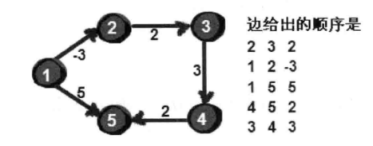
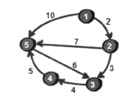

### 第一节 只有五行的算法--Floyd-Warshall

**[多源最短路径问题]**

例题： n 座城市之间存在单向路径长度（有些城市间有公路，有些无），小哼要进行城市间的旅游，计算任意两座城市之间的**最短路径**


如果两点之间 ，通过第三个点进行转折，反而路程更短；那么选择哪个点，中途增加几个点呢。

这里先假设只通过 1 号顶点做中转点，求任意两点的最短路径。

```javascript
var obj = [
  [0, 2, 6, 4],
  [null, 0, 3, null],
  [7, null, 0, 1],
  [5, null, 12, 0],
]
var n = 4
// 核心5行代码
for (let i = 0; i < n; i++) {
  for (let j = 0; j < n; j++) {
    if (obj[i][0] && obj[0][j] && i !== j) {
      obj[i][j] = obj[i][j]
        ? Math.min(obj[i][0] + obj[0][j], obj[i][j])
        : obj[i][0] + obj[0][j]
    }
  }
}
console.dir(obj)
```

接下来假设能经过 1、2 两个点，算出来的最短路径是？

```javascript
var obj = [
  [0, 2, 6, 4],
  [null, 0, 3, null],
  [7, null, 0, 1],
  [5, null, 12, 0],
]
var n = 4

// 经过1号顶点
for (let i = 0; i < n; i++) {
  for (let j = 0; j < n; j++) {
    if (obj[i][0] && obj[0][j] && i !== j) {
      obj[i][j] = obj[i][j]
        ? Math.min(obj[i][0] + obj[0][j], obj[i][j])
        : obj[i][0] + obj[0][j]
    }
  }
}

// 经过2号顶点
for (let i = 0; i < n; i++) {
  for (let j = 0; j < n; j++) {
    if (obj[i][1] && obj[1][j] && i !== j) {
      obj[i][j] = obj[i][j]
        ? Math.min(obj[i][1] + obj[1][j], obj[i][j])
        : obj[i][1] + obj[1][j]
    }
  }
}
console.dir(obj)
```

当允许经过 1、2、3 号点

```javascript
var obj = [
  [0, 2, 6, 4],
  [null, 0, 3, null],
  [7, null, 0, 1],
  [5, null, 12, 0],
]
var n = 4
var fs = (target) => {
  // 经过target号顶点
  for (let i = 0; i < n; i++) {
    for (let j = 0; j < n; j++) {
      if (obj[i][target] && obj[target][j] && i !== j) {
        obj[i][j] = obj[i][j]
          ? Math.min(obj[i][target] + obj[target][j], obj[i][j])
          : obj[i][target] + obj[target][j]
      }
    }
  }
}

fs(0)
fs(1)
fs(2)
console.dir(obj)
```

> 概括：从 i 号顶点到 j 号顶点只经过前 k 号点的最短路径。其实就是一种动态规划的思想

整个步骤虽然很麻烦，但是代码实现却很简单，核心代码如下

```js
let n = 4
var fs = (target) => {
  // 经过target号顶点
  for (let i = 0; i < n; i++) {
    for (let j = 0; j < n; j++) {
      if (obj[i][target] && obj[target][j] && i !== j) {
        obj[i][j] = obj[i][j]
          ? Math.min(obj[i][target] + obj[target][j], obj[i][j])
          : obj[i][target] + obj[target][j]
      }
    }
  }
}

for (let i = 0; i < n; i++) {
  fs(i)
}
```

时间复杂度要求不高的情况下，使用 Floyd-Warshall 来求指定两点之间的最短路径或者指定一个点到其余各个顶点的最短路径 都是可以的。还有更快的算法，就看下一节的 Dijkstra。

!> 另需要注意的是：本算法不能解决带有**负权回路**的图，因为带有负权回路的图没有最短路径。

### 第二节 Dijkstra 算法-- 通过边实现松弛

**[单源最短路径问题]**

例题： 下图六边形，不同的顶点到不同的顶点间存在单向值


1、先假设计算顶点 1 到各个顶点间的最短路径

```javascript
// 用二维数组表示的顶点之间边的关系， obj为初始值
var obj = [
  [0, 1, 12, null, null, null],
  [null, 0, 9, 3, null, null],
  [null, null, 0, null, 5, null],
  [null, null, 4, 0, 13, 15],
  [null, null, null, null, 0, 4],
  [null, null, null, null, null, 0]
]
var n = 6 // 当前是6个顶点
var book = [] // 确定标记过的顶点
for (let i = 0; i< n; i++) {
  book.push(0)
}
book[0] = 1

// 重点：存储初始化的1号顶点到其余各个顶点的初始路程
var dis = [...obj[0]]
let u = 0
for (let i = 0; i < n; i++) {
  let min = 999
  // 查找源点最近的一个顶点
  for (let j = 0; j < n; j++) {
    if ( book[j] === 0 && dis[j] && dis[j] < min) {
      min = dis[j]
      u = j
    }
  }
  book[u] = 1
  // dis[u] = obj[s][u]

  for (let a = 0; a < n; a++) {
    let num = obj[u][a]
    if (num) {
      if (dis[a] === null || num + dis[u] < dis[a]) {
        dis[a] = num + dis[u]
      }
    }
  }
}
console.warn('dis', dis) // [0, 1, 8, 4, 13, 17]
```

总结下算法的思想：

- 每次找到离源点（此处是 1 号）最近的一个顶点，然后以这个顶点为中心进行扩展，最终得到源点到其他所有点的最短路径。

基本步骤：

1. 所有顶点分为两部分：已知最短路程的顶点集合P和未知最短路程的顶点集合Q，最初，已知最短路程的顶点集合P只有源点一个顶点，用一个book数组来记录哪些点在集合P中。例如，book[i] == 1 表示i点在p中，book[i] == 0 表示i点在Q中。

2. 设置源点s到自己的最短路径为0，dis[s] = 0，如存在有源点可以直接到达的顶点i，直接把dis[i] = e[s][i]，同时把其他不能直接到达的顶点的最短路径全部设置成最大值  dis[i] = ∞。

3. 在集合Q中的所有顶点中找一个离源点s最近的顶点u，加入到集合P，并考察所有以点u为起点的边，对每一条边进行松弛操作。

4. 重复步骤3，如果集合Q为空，算法结束，最终dis数组的值就是源点到所有顶点的最短路径。


我们把 M（边数）远小于 N^2 的图称为*稀疏图*，反之为稠密图。

下一章可以用**邻接表**代替**邻接矩阵**，整个时间复杂度优化到 O(M+N)log(N)

最坏的情况下，M 就是 N^2, 这样的话(M+N)log(N)要比 N^2 还大。

> 现用邻接表储存上图（此处使用数组实现邻接表，并不是真正的指针链表） **【基于贪心策略的算法】**

``` js
// 4 5  // 代表4个点，5条边
// 1 4 9  // 分别用x, y, z表示，顶点x到顶点y的权值为z
// 2 4 6
// 1 2 5
// 4 3 8
// 1 3 7
```

现在用邻接表来存储这个图。代码如下:
```js
const n = 4
const m = 5
// u、v、w的数组大小要根据实际情况来设置，要比m的最大值要大1
let u = []
let v = []
let w = []
// first和next的数组大小要根据实际情况来设置，要比n的最大值大1
let first = []
// 初始化first数组下标1-n都为-1，表示1-n顶点暂时都没有边
for (let i = 0; i< n; i++){ first.push(-1)}
let next = [...first]

console.log(first)
for (let j = 0; j< m; j++){
  let list = prompt("顶点x到顶点y的权值为z,分别用x, y, z表示", '1,4,9')
  let arr = list.split(',')
  u.push(arr[0])
  v.push(arr[1])
  w.push(arr[2])
  next[j] = first[u[j]]
  first[u[j]] = j
}
console.log(u, v, w)
console.log(first, next)
```

这里其实使用数组来实现邻接表，并没有使用真正的指针链表，这是一种在很容易实现的方法。为每一个顶点i都设置了一个链表，里面保存了从顶点i出发的所有的边（这里用first和next数组实现）首先需要为每一条边进行1~m的编号，用u、v、w三个数组来记录每条边的信息。first数组用来存储1~n号顶点的第一条边的编号，初始值为-1。即first[u[i]]保存顶点u[i]的第一条边的编号，next[i]存储“编号为i的边”的“下一条边”的编号。

``` js
let k = first[0]
while (k !== -1) {
  console.log(u[k], v[k], w[k])
  k = next[k]
}
```

如何遍历每条边呢，注意first存储的是每个顶点i的第一条边，细心会发现，此时遍历某个顶点的边，他的遍历顺序正好与读入的顺序相反，因为在为每个顶点插入边的时候，都是直接插入“链表”的首部而不是尾部，真实这种奇妙之处，遍历每个顶点的边

``` js
for (let i = 0; i <n; i++) {
  let k = first[i]
  while (k !== -1 && k !== undefined) {
    console.log(u[k], v[k], w[k])
    k = next[k]
  }
}
```
可以发现使用邻接表来存储图的控件复杂度是O(M),遍历每条边的时间复杂度也是O(M)。如果是一个稀疏图的话，M要远小于N²。因此稀疏图选用邻接表来存储比用邻接矩阵要好很多。

>  本节求最短路径的算法是一种基于**贪心策略**的算法，但是局限性是，计算的最短路径图不能带有*负权边*，接下来讲述一个可以求带负权边的指定点到其余各个顶点的最短路径算法。

### 第三节 Bellman-Ford 解决负权边

Dijkstra 算法虽好，但是不能解决带有负权边的图。

Bellman-Ford 算法，不仅在思想上还是代码实现上都堪称完美的最短路算法。核心代码四行，就完美的解决带有负权边的图。

```javascript
for (let k = 1; k <= n - 1; k++) {
  for (let i = 1; i < m; i++) {
    if (dis[v[i]] > dis[u[i]] + w[i]) {
      dis[v[i]] = dis[u[i]] + w[i]
    }
  }
}
```
这个代码，外循环了n-1次（n为顶点个数），内循环了m次（m为边的个数），即枚举每一条边，dis数组的作用和Dijkstra算法一样，用来记录源点到其余各个顶点的最短路径，



给每条边都松弛一遍

```js
// 2 3 2   -1 -1
// 1 2 -3  2  -1
// 1 5 5   0   1
// 4 5 2   4  null
// 3 4 3   3  -1
// 根据上面三个一组的数据输入可以得到以下结果
// [0, -3, -1, 2, 4]
let n = 5
let m = 5
let u = [2, 1, 1, 4, 3]
let v = [3, 2, 5, 5, 4]
let w = [2, -3, 5, 2, 3]

let first = [-1, 2, 0, 4, 3]
let next = [-1, -1, 1, -1, -1]
// dis用来存储1号顶点到所有顶点的距离
let dis = [0, 999, 999, 999, 999]
// 从下标1开始遍历
for (let k = 1; k < n; k++) {
  /**
   * 方法1
  */
  for(let i = 0; i < m; i++){
    if (dis[v[i] -1] > dis[u[i] -1] + w[i]) {
      dis[v[i] -1] = dis[u[i] -1] + w[i]
    }
  }
  /**
   * 方法二
   * 通过first、next的顺序一条条更新dis
  */
  // let i = first[k] // 2
  // let nextVal = dis[v[i] -1] // -1
  // while (i !== -1) {
  //   console.log(u[i], v[i], w[i])
  //   if (nextVal){
  //     if (nextVal > dis[u[i] -1] + w[i]) {
  //       dis[v[i] - 1] = dis[u[i] -1] + w[i]
  //     }
  //   }else {
  //     dis[v[i] - 1] = dis[u[i] - 1] + w[i]
  //   }
  //   i = next[i]
  // }
}
// dis = [0, -3, -1, 2, 4]
console.log(dis)
```
方法一只做了三轮循环松弛完所有的边，方法二实际只遍历了m次做完了松弛更新。
所以最多对所有便进行n-1次“松弛”操作。

此外，Bellman-Ford算法还可以检测一个图是否含有负权回路。如果再进行n-1轮松弛之后，仍然存在dis更新的情况（也就是说可以继续成功松弛），那么此图必然存在负权回路。检查的代码如下：

```js
let n = 5
let m = 5
let u = [2, 1, 1, 4, 3]
let v = [3, 2, 5, 5, 4]
let w = [2, -3, 5, 2, 3]

let first = [-1, 2, 0, 4, 3]
let next = [-1, -1, 1, -1, -1]
// dis用来存储1号顶点到所有顶点的距离
let dis = [0, 999, 999, 999, 999]
// 从下标1开始遍历
for (let k = 1; k < n; k++) {
  for(let i = 0; i < m; i++){
    if (dis[v[i] -1] > dis[u[i] -1] + w[i]) {
      dis[v[i] -1] = dis[u[i] -1] + w[i]
    }
  }
}
/**
 * 检查负权回路
*/
let flag = 0
for(let i = 0; i < m; i++){
  if (dis[v[i] -1] > dis[u[i] -1] + w[i]) {
    flag = 1
  }
}
if (flag) {
  alert('该图含有负权回路')
}
```
方法一中的时间复杂度是O(MN),这个复杂度貌似比Dijkstra还要高，之前说过，实际操作未达到n-1轮就算出了最短路径，可以添加一个备份的数据，判断无变化跳出循环。

以上的算法的进一步优化在于，**每次仅对最短路估计值发生变化了的顶点的所有边执行松弛操作**,
详情看下一节， Bellman-Ford的队列优化


### 第四节 Bellman-Ford 的队列优化

上一节的优化，仅对最短路程发生变化的点的相邻边执行松弛操作。如何知道哪些点的最短路程发生了变化，可以用一个队列记录维护发生变化的点。

每次选取队首顶点u，对顶点u的所有出边进行松弛，比如 u -> v 的边，如果有松弛，并且顶点v不在当前队列中，就将顶点v放在队尾，注：同一个顶点同时在队列中出现多次无意义，所以需要一个数组来判重（是否已在队列中）。在对顶点u的所有出边松弛完毕之后，将顶点v出队。不断从列中取出新的队首顶点再进行如上操作，直至队列为空。

例子如下：

```js
5 7 // 5个顶点 7条边
1 2 2
1 5 10
2 3 3
2 5 7
3 4 4
4 5 5
5 3 6
```



继续用数组dis存放1号顶点到其余各点的最短路径，初始时dis[0]为0，其余无穷大
接下来1号顶点入队，队列用一个数组que以及两个指针（head指向队列头，tail指向队列为）来实现。
逻辑是que用来装载每次遍历出现的新节点，tail记录下次插入的序号，head在每次遍历完后往下一个顶点移动。直到与tail重逢。代码实现如下：

```js
const n = 5
const m = 7
// u、v、w的数组大小要根据实际情况来设置，要比m的最大值要大1
let u = []
let v = []
let w = []
const lines = [
  '1,2,2',
  '1,5,10',
  '2,3,3',
  '2,5,7',
  '3,4,4',
  '4,5,5',
  '5,3,6'
]
let dis = []
let book = [] // 记录哪些顶点已经在队列了
// first和next的数组大小要根据实际情况来设置，要比n的最大值大1
let first = []
// 初始化first数组下标1-n都为-1，表示1-n顶点暂时都没有边
for (let i = 0; i< n; i++){ first.push(-1); dis.push(9999); book.push(0)}
let next = [...first]
dis[0] = 0

console.log(first)
for (let j = 0; j< m; j++){
  let list = lines[j]
  // let list = prompt("顶点x到顶点y的权值为z,分别用x, y, z表示", lines[j])
  let arr = list.split(',')
  u.push(+arr[0])
  v.push(+arr[1])
  w.push(+arr[2])
  next[j] = first[u[j]]
  first[u[j]] = j
}
console.log(u, v, w)
console.log(first, next)

// 定义一个队列，并初始化队列
let que = []
let head = 0
let tail = 0

// 1号顶点入队
que[tail] = 0
tail++
book[0] = 1 // 标记第一个顶点已入队列
debugger
let k
while (head<tail){ // 队列不为空的时候循环
  k = first[que[head] + 1] // 当前需要处理的队首顶点
  while(k !== -1 && k !== undefined){ // 扫描当前顶点所有的边， 根据next找下一条
    let nextIndex = v[k] -1
    if (dis[nextIndex] > dis[u[k]-1] + w[k]) { // 判断是否松弛成功
      dis[nextIndex] = dis[u[k]-1] + w[k] // 更新到顶点v[k]的路程
      // book数组判断nextIndex是否在队列中
      if (book[nextIndex] === 0) {
        que[tail] = nextIndex
        tail++
        book[nextIndex] = 1
      }
    }
    k = next[k]
  }
  // 出队
  book[que[head]] = 0
  head++
}
// 预期结果  [0, 2, 5, 9, 5, 3, 6]
console.log(dis)
```

使用队列优化的Bellman-Ford算法在广度优先搜索非常类似，不同的是后者顶点出队后不会再进入队列。

使用队列优化的Bellman-Ford算法的时间复杂度，最坏的情况是O(NM)。如何判断一个图是否有负环？如果某个点进入队列的次数超过N次，这个图肯定存在负环。

用队列优化的Bellman-Ford算法的关键之处：只有在那些前一遍松弛中改变了最短路径估计值的顶点，才可能引起他们邻接点最短路径估计值的变化。


### 第三节最短路径算法对比分析


