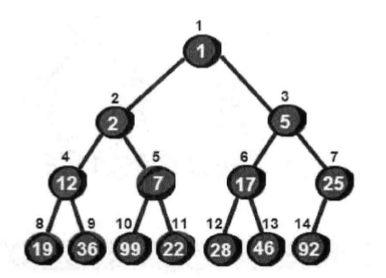
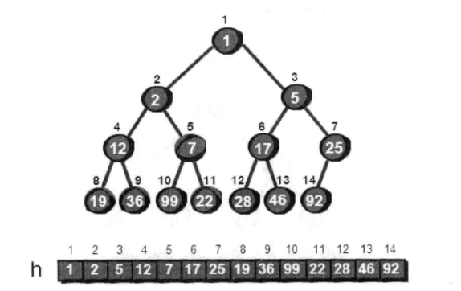
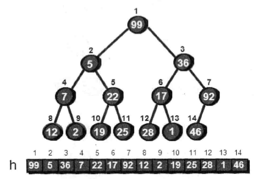

### 第一节 开启‘树’之旅

树有着**不包含回路**的特点,所以被赋予了很多特性.

1. 一棵树的任意两个节点有且仅有唯一的一条路径连通。
2.


### 第二节 二叉树

满二叉树


完全二叉树 ：对典型的应用就是堆。


### 第三节 堆————神奇的优先队列

堆是什么？是一种特殊的完全二叉树，如下图：



二叉树的特点： 所有父节点都比子节点小【最小堆】，或者所有父节点都比子节点大【最大堆】

如果需要删除一个最小数，再插入一个新数23。假设14个数按最小堆的要求放入一个完全二叉树.



> 方法一
```javascript
const list = [0, 1, 2, 5, 12, 7, 17, 25, 19, 36, 99, 22, 28, 46, 92];
// 假设删除根节点，插入新数23到根节点，此时不符合最小堆的情况， 需要调整
const length = list.length-1
function siftDown (i){
  // 检查下标i的数据是否符合最小堆的规则
  let num = list[i]
  // let t = 0;
  // let flag= 1;

  // while(i*2<length && flag) {
  //   if (list[i*2] < )
  // }
  // 判断i是否有子节点
  let childLeft = list[i*2]
  let childRight = list[i*2 + 1]
  let min = Math.min(childLeft, childRight) // 该计算中如果出现过undefined比较值， 比较结果就是NaN。
  // min为NaN时 与数值比较总是false，刚好中断循环
  if (min <num) {
    let index = i*2
    if (min === childRight) {
      index++
    }
    switchList(i, index)
    siftDown(index)
  }
}
function switchList (x, y) {
  let num = list[x]
  list[x] = list[y]
  list[y] = num
}
list[1] = 23
siftDown(1)
console.log(list)
```

> 方法二：

```javascript

const list = [0, 1, 2, 5, 12, 7, 17, 25, 19, 36, 99, 22, 28, 46, 92];
// 假设删除根节点，插入新数23到根节点，此时不符合最小堆的情况， 需要调整
const length = list.length -1
function siftDown (i){
  // 检查下标i的数据是否符合最小堆的规则
  let flag= 0;

  while(i*2<length && !flag) {
    let t = i;
    if (list[i] >list[i*2]) {
      t = i*2
    }
    if (((i*2 + 1)<=length) && (list[t] >list[i*2 +1])) {
      t = i*2 +1
    }
    console.log('t', t)
    if (t !== i ) {
      switchList(i, t)
      i = t
    } else {
      flag = 1
    }
  }
}
function switchList (x, y) {
  let num = list[x]
  list[x] = list[y]
  list[y] = num
}
list[1] = 23
siftDown(1)
console.log(list)
```

如果想新增一个值，而不是删除一个值。直接再插入到末尾，再根据情况，判断元素是否需要上移。直到满足堆的特性。
假设堆的大小为N，时间复杂度就是O(logN)。假设新增数字3

```javascript
const list = [0, 2, 7, 5, 12, 22, 17, 25, 19, 36, 99, 23, 28, 46, 92];
// 假设删除根节点，插入新数23到根节点，此时不符合最小堆的情况， 需要调整
const length = list.length - 1
function shiftUp (i){
  // 检查下标i的数据是否符合最小堆的规则
  let flag= 0;

  while(i>0 && !flag) {
    let middleIndex = parseInt(i/2)
    if (middleIndex > 0 && list[i] < list[middleIndex]){
      switchList(i, middleIndex)
      i = middleIndex
    } else {
      flag = 1
    }
  }
}
function switchList (x, y) {
  let num = list[x]
  list[x] = list[y]
  list[y] = num
}
list[length + 1] = 3
shiftUp(length+1)
console.log(list)
// 结果 [0, 2, 7, 3, 12, 22, 17, 5, 19, 36, 99, 23, 28, 46, 92, 25]
```

##### 接下来是很重要的一点： 如何搭建堆！

可以从空的堆开始，一次往堆中插入每一个元素，因为插入第i个元素花费的时间为O(log i),所以插入所有元素的时间为O(N(logN))。代码如下

```js
let n = 0
for(let i = 1; i< m; i++) {
  n++
  h[n] = a[i]
  siftUp(i)
}
```

其实还有更快的方式建立堆：
直接把99、5、36、7、22、17、46、12、2、19、25、28、1和92这14个数放入一个完全二叉树，（实际还是用数组存储）



在这个完全二叉树中，我们从最后一个节点开始，找出最后的子树一次排序，但是已知叶节点已经没有子节点，符合堆的特性，所以从最后一个非叶节点遍历查找，已知公式最后一个非叶节点是第n/2个结点。

逐个扫描所有节点，虽然看起来复杂，其实代码很简单:
```js
for(let i = parseInt(n/2); i>0; i--) {
  siftDown(i)
}
```
用这个方法建立堆的时间复杂度只有O(N).

> 堆还有一个作用，就是**堆排序**, 与快速排序一样，堆排序的时间复杂度也是O(N logN)

堆排序的实现原理很简单，假设建立的是最小堆，

```js
// 删除最小的元素
function deleteMin () {
  let t = h[1]; // 用一个临时变量记录堆顶点的值
  h[1] = h[n]; // 将堆的最后一个数放置顶点，
  n--; // 堆少一个数
  siftDown(1) // 向下调整
  return t
}

```

建堆以及堆排序的完整代码：
```js

// 假设读入的数据为 用来存放堆的数组
let h = [0, 99, 5, 36, 7, 22, 17, 46, 12, 2, 19, 25, 28, 1, 92 ]
let n = 14 // 堆的大小

// 交换函数
function switchList (x, y) {
  let num = h[x]
  h[x] = h[y]
  h[y] = num
}
// 删除最大的元素
function deleteMin () {
  let t = h[1]; // 用一个临时变量记录堆顶点的值
  h[1] = h[n]; // 将堆的最后一个数放置顶点，
  n--; // 堆少一个数
  siftDown(1) // 向下调整
  return t
}
//建立堆的函数
function createHeap () {
  // 从最后一个非叶子节点依次向上调整
  for(let i = parseInt(n/2); i>0; i--) {
    siftDown(i)
  }
}
// 向下调整函数
function siftDown (i){
  // 检查下标i的数据是否符合最小堆的规则
  let flag= 0
  const length = n
  while(i*2<=length && !flag) {
    let t = i;
    if (h[i] >h[i*2]) {
      t = i*2
    }
    if (((i*2 + 1)<=length) && (h[t] >h[i*2 +1])) {
      t = i*2 +1
    }
    if (t !== i ) {
      switchList(i, t)
      i = t
    } else {
      flag = 1
    }
  }
}

function main () {

  // 建堆
  createHeap()
  console.log('排序后', h)
  // 删除顶部元素，连续删除n次， 其实也就是从小到大把数拿出来。
  const length = h.length
  for (let i = 1; i < length; i++) {
    console.log(deleteMin())
  }
}
console.log('初始化', h)
main()
```

当然堆排序还有更好的办法，从小到大排序的时候不是搭建最小堆，而是建立最大堆。最大的元素在h【1】,因为我们的需求是从小到大排序，希望最大数在最后面，因此可以将h【1】与h【n】置换，然后再从1的位置向下排序以保持堆的特性。再将堆的大小减一 n--，然后再继续h【1】与h【n】置换的操作，如此反复，直到堆的大小变为1。此时堆的排序就是好了的。

```js
// 堆排序,假设此中的siftDown是生成最大堆
function heapSort() {
  while(n>1) {
    switchList(1, n+1)
    n--
    siftDown(1)
  }
}
```

完整的堆排序如下，注意使用这种方式搭建的堆必须是最大堆。

```js

// 假设读入的数据为 用来存放堆的数组
let h = [0, 99, 5, 36, 7, 22, 17, 46, 12, 2, 19, 25, 28, 1, 92 ]
let n = 14 // 堆的大小

// 交换函数
function switchList (x, y) {
  let num = h[x]
  h[x] = h[y]
  h[y] = num
}
//建立堆的函数
function createHeap () {
  // 从最后一个非叶子节点依次向上调整
  for(let i = parseInt(n/2); i>0; i--) {
    siftDown(i)
  }
}
// 向下调整函数
function siftDown (i){
  // 检查下标i的数据是否符合最大堆的规则
  let flag= 0;
  const length = n
  while(i*2<=length && !flag) {
    let t = i;
    if (h[i] < h[i*2]) {
      t = i*2
    }
    if (((i*2 + 1)<=length) && (h[t] <h[i*2 +1])) {
      t = i*2 +1
    }
    if (t !== i ) {
      switchList(i, t)
      i = t
    } else {
      flag = 1
    }
  }
}
// 堆排序
function heapSort() {
  while(n>1) {
    switchList(1, n)
    n--
    siftDown(1)
  }
}

function main () {
  // 建堆
  createHeap()
  console.log('最大堆h', h)
  heapSort()
  console.log('从小到大排序后h', h) // [0, 1, 2, 5, 7, 12, 17, 19, 22, 25, 28, 36, 46, 92, 99]
}
console.log('初始化', h)
main()
```
> 总结： 这种支持插入元素和寻找最大（小）值元素的数据结构称为**优先队列**，，如果使用普通队列来实现这两个功能，需要的时间复杂度比较高,如果是已经排序好的数组，如果插入一个数，需要移动挺多元素。时间复杂度依然高。而堆是一种优先队列的实现，可以很好的解决这两种操作

另外Dijkstra算法中每次找离源点最近的一个顶点，也可以用堆来优化，算法的时间复杂度降到O((M+N)logN).

堆还常用来寻找第K大的数，只需要建立一个大小为k的最小堆，堆顶就是第K大的数。

同理，如何寻找第k小的数，建立一个大小为K的最大堆，堆顶就是第k小的数。这种方法的时间复杂度是O(N logK)


### 第4节  擒贼先擒王 --- 查并集

**解密犯罪团伙**

假设已知10个强盗的关系，需要协助警方查出来一共有多少个犯罪团伙。
- 1号强盗与2号强盗是同伙
- 3号强盗与4号强盗是同伙
- 5号强盗与2号强盗是同伙
- 4号强盗与6号强盗是同伙
- 2号强盗与6号强盗是同伙
- 8号强盗与7号强盗是同伙
- 9号强盗与7号强盗是同伙
- 1号强盗与6号强盗是同伙
- 2号强盗与4号强盗是同伙

根据线索， 一步步的“合并同伙”

1. 申请一个一维数组f，用数组下标来记录不同编号的强盗，下标对应的单元格记录每个强盗的BOSS是谁。
2. 初始化，最开始十个强盗各自为政。
3. ‘合并同伙’，采用**靠左法则**，'1号强盗与2号强盗是同伙'这种情况，其实归属谁都可以。有了统一的规则后，得到结论是f[2] 改为 1。第二个规则是**擒贼先擒王**，假设5号强盗与2号强盗是同伙这种情况，2号强盗已经归顺了1号强盗。2号归属1还是5都有争议，采用第二个原则，让2的领导1归顺5，此时f[1] 也要改变成5，f[2] 也为5。此处2的索引内容改成5并不是必须的，只是为了提高找到最高级领导人的速度。
4. 根据上述两个原则，会过滤掉一些冗余数据，最终结果为[0, 5, 5, 5, 3, 5, 5, 9, 9, 9, 10]，由此可一眼看出有三个犯罪团伙。最后只有f[5] = 5, f[9]=9, f[10] = 10,只有三个数等于自身，所以是三个独立的犯罪团伙。

上述模拟的就是查并集的算法，其本质是维护一个森林。刚开始 森林的数都是孤立的，经过一些条件，逐渐合并成一颗大树。合并的过程遵循“靠左法则”和“擒贼先擒王”，注意查询两个节点为同一个树的时候，不要忘了求其根源，上例的f[4] = 3, 3只是其中一个小boss， f[3] = 5,其实和其他前六位是一颗树下的。

“解密犯罪团伙”的代码如下。

```js
let f = [0]
const n = 10
// 初始化，存数组下标的编号即可
function init () {
  for (let i = 1; i<= n; i++) {
    f[i] = i
  }
}

// 查找上一级，直到找到最高级，“擒贼先擒王”的规则
function getf (v){
  if (f[v] === v) {
    return v
  } else {
    // 这里是路径压缩，每次函数返回的时候，顺便把路上遇到的人都改成最终BOSS，这样可以提高今后找到最高领导人的速度。
    f[v] = getf(f[v])
    return f[v]
  }
}
// 合并两子集合的函数
function merge (v, u) {
  // 先查找两个节点的是否是同一个祖先
  let t1 = getf(v)
  let t2 = getf(u)
  if (t1 !== t2) {
    // 靠左原则
    f[t2] = t1
  }
}

function main () {
  // 初始化
  init()

  // 记录犯罪关系
  const inputList = [
    [1, 2],
    [3, 4],
    [5, 2],
    [4, 6],
    [2, 6],
    [8, 7],
    [9, 7],
    [1, 6],
    [2, 4]
  ]
  let length = inputList.length
  for(let i = 0; i< length; i++) {
    // 开始合并犯罪团伙
    merge(...inputList[i])
  }
  // 计算一共有多少个犯罪团伙
  let sum = 0
  for(let v = 1; v <= n; v++) {
    if(f[v] === v ) {
      sum++
    }
  }
  console.log(`总计${sum}个犯罪团伙`)
}
main()

```

并查集也称为不相交集数据结构，此算法发展历经十多年。其实树还有很多其他用法，比如： 线段树、树状数组、Trie树（字典树）、二叉搜索树、红黑树等

