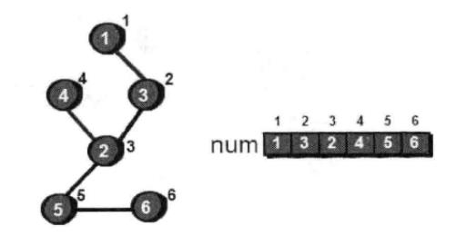

### 第一节 镖局运镖--图的最小生成树

古代镖局的运镖，相当于现在的物流；商号开在哪里，镖局便设在哪里。假设镖局每到一个新地方发展业务，都需要对途中的绿林好汉进行打点，费用不等。

已知城镇地图如下，顶点是城镇编号，边上的树代表打点金额。


给出的数据如下

> 6个点，9条边
> 1 2 1
> 2 4 11
> 4 6 3
> 3 5 13
> 5 6 4
> 2 3 6
> 4 5 7
> 3 4 9
> 1 3 2

镖局需要进行一些道路疏通，以最少的开销达到任意一个城镇。换言之，用最少的边让图连通。其实就是将多余的边去掉。**要想让有n个顶点的图连通，至少需要n-1条边**

上章说过，一个连通无向图不包括回路，就是一棵树。其实就是求一个图的最小生成树。此处只讨论无向图的最小生成树。

> 如何拿到最佳方案的最小生成树呢：

- 第一步，先对所有的边按权值进行从小到大的排序，从最小的开始，依次选择每一条边。直到选择了n-1条边让图连通为止。

上面条件排序后
> 1 2 1
> 1 3 2
> 4 6 3
> 5 6 4
> 2 3 6
> 4 5 7
> 3 4 9
> 2 4 11
> 3 5 13

选择过程如下：


到此都很完美，直到2 3 6这条边，此时发现2和3顶点已经相通了，加上成了回路就不符合树，因此跳过这条边，同理不能选4 5 7这条边。

接下来选择的就是3 4 9这条边后，已经达成n-1条边了，图已连通


回顾刚才的算法，难点在于判断两个顶点是否已**连通**，这个可以用深度优先搜索或者广度优先搜索，但是效率较低；上一节的并查集处理。

将所有点放入一个并查集，判断两个顶点是否连通，只需判断两个顶点是否在同一个集合（即是否有共同的祖先）即可，时间都仅有O(logN)。这个算法叫**Kruskal**

> 总结： 将所有的边按权值从小到大排序，依次检查，让两点不属于同一个集合的边加入生成树，直至加入了n-1条边。代码如下：

```js
let n = 6 // 一共有6个顶点
const f = new Array(n +1).fill(0)
const list = [
  [1, 2, 1],
  [1, 3, 2],
  [4, 6, 3],
  [2, 4, 11],
  [5, 6, 4],
  [2, 3, 6],
  [4, 5, 7],
  [3, 4, 9],
  [3, 5, 13]
]
function init () {
  for (let i = 1; i<= n; i++) {
    f[i] = i
  }
}
function merge (l, r) {
  let t1 = getf(l)
  let t2 = getf(r)
  if (t1 !== t2) {
    f[t2] = t1
  }
}
function getf (v) {
  if (f[v] === v) {
    return v
  } else {
    f[v] = getf(f[v])
    return f[v]
  }
}
function quickSort (arr) {
  arr.sort((l, r) => l[2] - r[2])
  return arr
}
function main () {
  init()
  let sum = 0
  let length = list.length
  let step = 0
  quickSort(list) // 按照边的权值进行从小到大排序

  // 开始Kruskal算法核心
  for (let i = 0; i< length && step< n; i++) {
    let [l, r, len] = list[i]
    if (getf(l) !== getf(r)) {
      merge(l, r)
      sum +=len
      step++
      if (step === (n-1)) {
        break
      }
    }
  }
  console.log('最终计算的最小树长度', sum)
}
main()

```

Kruskal算法的时间复杂度, 对边进行快速排序是O(MlogM)， 但是对M条边找出n-1条边是O(MlogN),所以Kruskal算法的时间复杂度为O(MlogM + MlogN)，通常M要比N大很多，所以最终时间复杂度是O(MlogM)

### 第2节 再谈最小树

换个思路，其实就是n-1条边把n个顶点连接起来，每个顶点必有一个边与之相连。随便从一个点开始（需要筛选最短边的一个点），1 2 1这条边最短，1号和2号顶点标记起来。接下来枚举1号和2号顶点所有的边，找到最小边并且没标记过的点 -- 3，照此方法，一共重复n-1次，直到所有顶点都被选中，算法结束。这个方法像一棵“生成树”慢慢长大，从一个顶点长到n个顶点。

> 总结： 将所有的顶点分两类，树顶点（已被选入生成树的顶点）、非树顶点（还未被选入生成树的顶点）。


代码如下：
```js
const n = 6 // 6个顶点
const m = 9 // 9条边

let e = Array(n + 1).fill([0, 0, 0, 0, 0, 0, 0]) // 7*7
let dis = Array(n + 1).fill(0) // 7位数组
let book = Array(n + 1).fill(0) // 标记加入生成树的顶点

let count = 0 // 记录加入生成树的顶点个数
let sum = 0 // sum用来存储路径之和
let h = []
const list = [
  '2,4,11', '3,5,13', '4,6,3', '5,6,4', '2,3,6', '4,5,7', '1,2,1', '3,4,9', '1,3,2'
]
// 初始化
for (let i = 0; i <= n; i++) {
  for (let j = 0; j <= n; j++) {
    if (i === j) {
      e[i][j] = 0
    } else {
      e[i][j] = 999
    }
  }
}

// 开始读入边
for(let i = 0; i< m; i++) {
  let [x, y, num] = list[i].split(',')
  // 此处是无向图，需要正反存储一下
  e[x][y] = +num
  e[y][x] = +num
}
console.log(e)
// 开始初始化dis数组，这里从一号顶点开始计算各个顶点的初始化距离，当前树只有一号顶点
for (let i = 1; i <= n; i++) {
  dis[i] = e[1][i]
}
console.log(dis)

// Prim算法核心开始
// 将1号顶点加入树
book[1] = 1
count++
h.push(1)
let j = 0
while (count < n) {
  let min = 999
  debugger
  for (let i = 1; i<= n; i++) {
    // 寻找未标记的最小值
    if (book[i] === 0 && (dis[i] < min)) {
      min = dis[i]
      j = i
    }
  }
  book[j] = 1
  count++
  sum += +dis[j]
  h.push(j)

  // 扫描当前所有顶点J的边，以j为中心点，更新生成树到每一个非树点的距离
  for (let k = 1; k<=n; k++) {
    if (book[k] === 0 && e[j][k] < dis[k]) {
      dis[k] = e[j][k]
    }
  }
}

console.log('sum', sum) // 结果是19
console.log('h', h) //  [1, 2, 3, 4, 6, 5]

```
以上这种方法的时间复杂度是O(N^2)；如果借助“堆”，每次选边的时间复杂度是O(logM),使用邻接表来存储图的话，整个算法的时间复杂度会降至O(M logN)。那么如何使用堆来优化呢。需要三个数组：

数组【dis】用来记录生成树到各个顶点的距离，数组【h】是一个最小堆，存储的是顶点编号（不是按照顶点编号的大小建立的堆，而是按照顶点在数组dis中所对应的值来建立这个最小堆），最后一个数组【pos】来记录每个顶点在最小堆中的位置，

```js
const n = 6 // 6个顶点
const m = 9 // 9条边
let dis = new Array(n+1).fill(99999) // 初始化dis，存储假设的最大值
let book = new Array(n+1).fill(0) // 记录哪些顶点已经放入生成树
let h = [...new Array(n+1).keys()] // 保存堆
let pos = [...new Array(n+1).keys()] // 存储每个顶点到堆中的位置
let size = 6 // 堆的大小

// 交换函数
function swap (x, y) {
  let cur = h[x]
  h[x] = h[y]
  h[y] = cur

  // 同步更新pos
  cur = pos[h[x]]
  pos[h[x]] = pos[h[y]]
  pos[h[y]] = cur
}

// 向下调整函数
function siftDown (i) { // i 需要向下调整的结点编号
  let t
  let flag = 0
  while (i*2 <= size && flag === 0) {
    // 比较i和他左儿子i*2在dis中的值，t记录值较小的结点编号
    if (dis[h[i]] > dis[h[i*2]]) {
      t = i * 2
    } else {
      t = i
    }
    // 如果有右儿子，继续判断
    if ((i*2 +1 <= size) && (dis[h[i]] > dis[h[i*2 +1]])) {
      t = i*2+1
    }

    // 如果发现最小的编号不是本身
    if (t !== i) {
      swap(i, t)
      i = t
    } else {
      flag = 1
    }
  }
}

// 向上调整函数
function siftUp (i) { // i 需要向上调整的结点编号
  let flag = 0
  if (i === 1) {return}
  // 不在堆顶，并且 当前节点的值比父节点小，继续向上调整

  while (i !== 1 && flag === 0) {
    // 比较i和他左儿子i*2在dis中的值，t记录值较小的结点编号
    let pre = parseInt(i/2)
    if (dis[h[i]] < dis[h[pre]]){
      swap(i, pre)
    } else {
      flag = 1
    }
    i = pre
  }
}

// 从堆顶拿出一个元素
function pop () {
  let t = h[1] // 临时变量记录堆顶点的值
  pos[t] = 0 // 可省略
  h[1] = h[size]
  pos[h[1]] = 1
  size--
  siftDown(1)
  return t
}

function main () {
  // u v w 因为是无向图，存储两倍的量
  let u = new Array(2*m + 1)
  let v = new Array(2*m + 1)
  let w = new Array(2*m + 1)
  let first = new Array(n + 1).fill(-1)
  let next = new Array(2*m + 1)
  let count = 0
  let sum = 0
  const inputList = [
    '2,4,11',
    '3,5,13',
    '4,6,3',
    '5,6,4',
    '2,3,6',
    '4,5,7',
    '1,2,1',
    '3,4,9',
    '1,3,2'
  ]

  // 开始读入边
  for (let i = 1; i<= m; i++) {
    let [x,y,l] = inputList[i-1].split(',')
    u[i] = +x
    v[i] = +y
    w[i] = +l
  }
  // 因为是无向图，反向存储一下
  for (let i = m+1; i<= 2*m; i++) {
    u[i] = v[i-m]
    v[i] = u[i-m]
    w[i] = w[i-m]
  }
  console.log(u, v, w)

  // 开始使用邻接表存储边
  for (let i = 1; i <= 2*m; i++) {
    next[i] = first[u[i]]
    first[u[i]] = i
  }
  console.log(first, next)
  // Prim核心部分开始
  // 加1号顶点到生成树
  book[1] = 1
  count++

  // 初始化dis数组，这里是1号顶点到其余各个顶点的初始距离
  dis[1] = 0
  dis[0] = 0

  let k = first[1]
  while (k != -1) {
    dis[v[k]] = w[k]
    k = next[k]
  }
  console.log('初始化的H', h)
  console.log('第一轮dis', dis)
  // 初始化堆， 堆排序
  for(let i = 3; i>=1; i--) {
    siftDown(i)
  }

  pop() // 为啥这步要去掉，和书本上的不一样。

  console.log('首次排序后的h', h)

  while (count < n) {
    j = pop()
    console.log('拿掉堆顶的H', j, size, h)

    book[j] = 1
    count++
    console.log(j, dis[j])
    sum = sum + dis[j]

    // 扫描当前j顶点的所有边，再以j为中心节点，进行松弛
    k = first[j]
    while (k != -1) {
      // if (book[v[k]] === 0 ) {
      if (book[v[k]] === 0 && dis[v[k]] > w[k]) {
        dis[v[k]] = w[k] // 更新距离
        siftUp(pos[v[k]]) // 对该点在堆中向上调整
        // 提示： pos[v[k]]存储的是顶点v[k]在堆中的位置
      }
      k = next[k]
    }
    console.log('dis', dis)
  }
  console.log('sum', sum)
  return
}
main()
```

**Kruskal算法**是一步步将森林的树进行合并，而**Prim算法**则是通过每一次增加一条边来建立一条树。Kruskal算法更适合稀疏图，没使用堆优化的Prim算法适用于稠密图，但是使用了堆优化的Prim算法更适合稀疏图。


### 第3节 重要城市-图的割点

如何销毁一个节点，导致无向连通图不再连通（任意两点不能相互到达）。这种点被称为割点（或者割顶）。


上图中明显可以看出2号节点就是割点。如何找出？

最容易想到的方法：依次删除每个顶点，然后用深度优先搜索或者广度优先搜索来检查是否依然连通。如果删除某点后，图不再连通，此就是割点。时间复杂度是O(N(N + M))。是否有更好的办法。

1. 首先从任意一个点（如1号顶点）开始对图做遍历，如果使用深度优先搜索进行遍历，下图就是一种遍历方案。（对一个图进行深度优先搜索遍历生成的树不一定是最小生成树）



【圆圈中的数字为顶点编号，圆圈右上角的数字代表该顶点是第几个被访问到的，专业名词为“时间戳”，此处用num数组存储所有顶点的时间戳】

**如何认定一个顶点是割点？**假如已经访问到k点，此时图就被分为两个部分，访问过的点、没访问过的点。如果k是割点，剩下没被访问的点中至少会有一个在不访问k点的前提下，无论如何再也回不到已访问过的点。那么一个连通图就被k点分割成多个不被连通的图了。为了不重复计算，需要一个数组low来记录每个顶点不经过父顶点时，能够回到的最小“时间戳”，如下图


算法的关键： 对于某个顶点u，如果存在至少一个顶点v（即顶点u的儿子），使得low[v] >= num[u]，即不能回到祖先，那么u点为割点。

```js
const n = 6 // 顶点数
const m = 7 // 边数
let index = 0 // 时间戳
const root = 0 // 根顶点
let num =  new Array(9).fill(0)
let low =  new Array(9).fill(0)
let flag =  new Array(9).fill(0)
const e = new Array(9).fill(0).map((i) => new Array(9).fill(0)) // 9*9

// 割点算法的核心
function dfs (cur, father) { // 传入当前顶点编号和父顶点编号
  let child = 0 // 用来记录当前顶点cur拥有的儿子个数
  let i
  let j
  index++ // 时间戳+1
  num[cur] = index
  low[cur] = index

  // 枚举与当前顶点cur有边相连的顶点i
  for (let i = 1; i<=n; i++) {
    if (e[cur][i] === 1) {
      if (num[i] === 0) { // 如果顶点的时间戳不为0，说明顶点i还没被访问过
        child++
        dfs(i, cur) // 继续往下深度优先遍历
        // 更新当前顶点cur是否能访问到最早顶点的时间戳
        low[cur] = Math.min(low[cur], num[i])
        // 如果当前节点不是根节点，并且满足low[i] >= num[cur]， 则当前顶点为割点
        if (cur !== root && low[i] >=num[cur]) {
          flag[cur] = 1
        }
      }
    }

  }
}


function main () {
  const list = [[1, 4], [1, 3], [4, 2], [3, 2], [2, 5], [2, 6], [5, 6]]

  for (let i = 0; i< m; i++) {
    let [x, y] = list[i]
    e[x][y] = 1
    e[y][x] = 1
  }
  dfs(1, root) // 从一号顶点开始深度遍历

  for (let i = 1; i<=n; i++) {
    // 打印割点
    if (flag[i] === 1) console.log(i)
  }
  return
}


```


