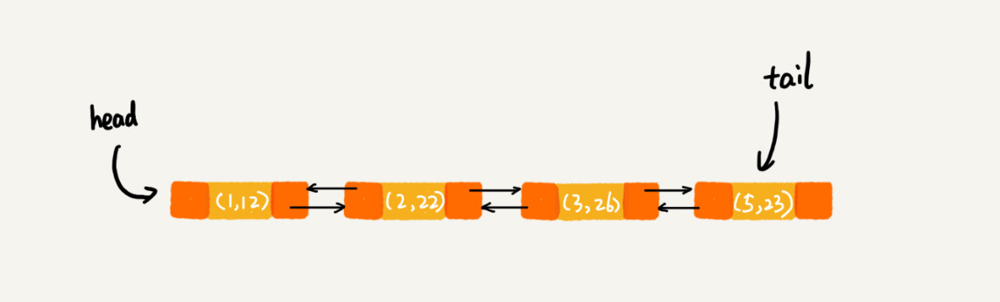

有没有发现，有两种数据结构，散列表和链表，经常会被放在一起使用。

在[链表](structures&algorithms/6.md)那一节，我讲到如何用链表来实现`LRU缓存淘汰算法`，但是链表实现的LRU缓存淘汰算法的时间复杂度是O(n)，当时我也提到了，通过散列表可以将这个时间复杂度降低到O(1)。

在[跳表](structures&algorithms/17.md)那一节，我提到Redis的有序集合是使用跳表来实现的，跳表可以看作一种改进版的链表。当时我们也提到，Redis有序集合不仅使用了跳表，还用到了散列表。

除此之外，如果你熟悉Java编程语言，你会发现`LinkedHashMap`这样一个常用的**容器**，也用到了散列表和链表两种数据结构。

#### LRU缓存淘汰算法

在**链表**那一节中，我提到，借助散列表，我们可以把LRU缓存淘汰算法的时间复杂度降低为O(1)。现在，我们就来看看它是如何做到的。

**如何通过链表实现LRU缓存淘汰算法**

1. 需要维护一个按照`访问时间从大到小`有序排列的链表结构。因为缓存大小有限，当缓存空间不够，需要淘汰一个数据的时候，我们就直接将`链表头部`的结点`删除`。

2. 当要缓存某个数据的时候，先在链表中查找这个数据。如果没有找到，则直接将数据放到`链表的尾部`；如果找到了，我们就把它移动到链表的尾部。因为查找数据需要遍历链表，所以单纯用链表实现的LRU缓存淘汰算法的时间复杂很高，是`O(n)`。

**总结一下**，一个缓存（cache）系统主要包含下面这几个操作：

- 往缓存中添加一个数据；

- 从缓存中删除一个数据；

- 在缓存中查找一个数据。

这三个操作都要涉及`“查找”`操作，如果单纯地采用链表的话，时间复杂度只能是`O(n)`。如果我们将散列表和链表两种数据结构组合使用，可以将这三个操作的时间复杂度都降低到`O(1)`。具体的结构就是下面这个样子：

我们使用双向链表存储数据，链表中的每个结点处理存储数据（data）、前驱指针（prev）、后继指针（next）之外，还新增了一个特殊字段`hnext`。这个hnext有什么作用呢？

因为我们的散列表是通过链表法解决散列冲突的，所以每个结点会在两条链中。一个链是刚刚我们提到的**双向链表**，另一个链是散列表中的**拉链。前驱和后继指针是为了将结点串在双向链表中，hnext指针是为了将结点串在散列表的拉链中**。

根据这种结构，前面讲到的缓存的三个操作，是如何做到时间复杂度是O(1)的？

- 首先，我们来看如何**查找一个数据**。我们前面讲过，散列表中查找数据的时间复杂度接近O(1)，所以通过散列表，我们可以很快地在缓存中找到一个数据。当找到数据之后，我们还需要将它移动到双向链表的尾部。

- 其次，我们来看如何**删除一个数据**。我们需要找到数据所在的结点，然后将结点删除。借助散列表，我们可以在O(1)时间复杂度里找到要删除的结点。因为我们的链表是双向链表，双向链表可以通过前驱指针O(1)时间复杂度获取前驱结点，所以在双向链表中，删除结点只需要O(1)的时间复杂度。

- 最后，我们来看如何**添加一个数据**。添加数据到缓存稍微有点麻烦，我们需要先看这个数据是否已经在缓存中。如果已经在其中，需要将其移动到双向链表的尾部；如果不在其中，还要看缓存有没有满。如果满了，则将双向链表头部的结点删除，然后再将数据放到链表的尾部；如果没有满，就直接将数据放到链表的尾部

这整个过程涉及的查找操作都可以通过`散列表`来完成。其他的操作，比如删除头结点、链表尾部插入数据等，都可以在`O(1)`的时间复杂度内完成。所以，这三个操作的时间复杂度都是O(1)。至此，我们就通过散列表和双向链表的组合使用，实现了一个高效的、支持LRU缓存淘汰算法的缓存系统原型。

#### Redis有序集合

在[跳表](structures&algorithms/17.md)那一节，讲到有序集合的操作时，我稍微做了些简化。实际上，在有序集合中，每个成员对象有两个重要的属性，key（键值）和score（分值）。我们不仅会通过score来查找数据，还会通过key来查找数据。

    比如用户积分排行榜有这样一个功能：我们可以通过用户的ID来查找积分信息，也可以通过积分区间来查找用户ID或者姓名信息。这里包含ID、姓名和积分的用户信息，就是成员对象，用户ID就是key，积分就是score。

如果我们细化一下Redis有序集合的操作，那就是下面这样：

- 添加一个成员对象；

- 按照键值来删除一个成员对象；

- 按照键值来查找一个成员对象；

- 按照分值区间查找数据，比如查找积分在[100, 356]之间的成员对象；

- 按照分值从小到大排序成员变量；

如果我们仅仅按照分值将成员对象组织成跳表的结构，那按照键值来删除、查询成员对象就会很慢，解决方法与LRU缓存淘汰算法的解决方法类似。我们可以再按照键值构建一个散列表，这样按照key来删除、查找一个成员对象的时间复杂度就变成了O(1)。同时，借助跳表结构，其他操作也非常高效。

Redis有序集合的操作还有另外一类，也就是**查找成员对象的排名（Rank）**或者根**据排名区间查找成员对象**。这个功能单纯用刚刚讲的这种组合结构就无法高效实现了。这块内容我后面的章节再讲。

#### Java LinkedHashMap

之前讲过，`HashMap`底层是通过`散列表`这种数据结构实现的。而`LinkedHashMap`前面比HashMap多了一个`“Linked”`，这里的“Linked”是不是说，LinkedHashMap是一个通过**链表法解决散列冲突的散列表**呢？

实际上，LinkedHashMap并没有这么简单，其中的“Linked”也并不仅仅代表它是通过链表法解决散列冲突的。关于这一点，在我是初学者的时候，也误解了很久。

~~~ java
// 先来看一段代码。你觉得这段代码会以什么样的顺序打印3，1，5，2这几个key呢？原因又是什么呢？
HashMap<Integer, Integer> m = new LinkedHashMap<>();
m.put(3, 11);
m.put(1, 12);
m.put(5, 23);
m.put(2, 22);

for (Map.Entry e : m.entrySet()) {
  System.out.println(e.getKey());
}
~~~

答案: 上面的代码会按照数据插入的顺序依次来打印，也就是说，打印的顺序就是`3，1，5，2`。你有没有觉得奇怪？散列表中数据是经过散列函数打乱之后`无规律存储`的，这里是如何实现按照数据的`插入顺序`来遍历打印的呢？

LinkedHashMap也是通过`散列表`**和**`链表`组合在一起实现的。实际上，它**不仅支持按照插入顺序遍历数据**，**还支持按照访问顺序来遍历数据**。你可以看下面这段代码：

~~~ java
// 10是初始大小，0.75是装载因子，true是表示按照访问时间排序
HashMap<Integer, Integer> m = new LinkedHashMap<>(10, 0.75f, true);
m.put(3, 11);
m.put(1, 12);
m.put(5, 23);
m.put(2, 22);

m.put(3, 26); // 第8行
m.get(5); // 第9行

for (Map.Entry e : m.entrySet()) {
  System.out.println(e.getKey());
}
// 打印的结果是1，2，3，5。
~~~

分析一下，为什么这段代码会按照这样顺序来打印。

每次调用put()函数，往LinkedHashMap中添加数据的时候，都会将数据添加到链表的尾部，所以，在前四个操作完成之后，链表中的数据是下面这样：

在`第8行`代码中，`再次`将键值为3的数据放入到LinkedHashMap的时候，会先查找这个键值是否已经有了，然后，再将已经存在的(3,11)删除，并且将新的(3,26)放到链表的`尾部`。所以，这个时候链表中的数据就是下面这样：

当`第9行`代码`访问`到key为5的数据的时候，我们将被访问到的数据移动到链表的`尾部`。所以，第9行代码之后，链表中的数据是下面这样：

所以，最后打印出来的数据是`1，2，3，5`。从上面的分析，你有没有发现，按照访问时间排序的LinkedHashMap本身就是一个`支持LRU缓存淘汰策略的缓存系统.`

总结一下，实际上，**LinkedHashMap是通过双向链表和散列表这两种数据结构组合实现的。LinkedHashMap中的“Linked”实际上是指的是双向链表，并非指用链表法解决散列冲突。**

#### 解答开篇&内容小结

*为什么散列表和链表经常一块使用？*

散列表这种数据结构虽然支持非常高效的数据插入、删除、查找操作，但是散列表中的数据都是通过散列函数打乱之后无规律存储的。也就说，它无法支持按照某种顺序快速地遍历数据。如果希望按照顺序遍历散列表中的数据，那我们需要将散列表中的数据拷贝到数组中，然后排序，再遍历。

因为散列表是动态数据结构，不停地有数据的插入、删除，所以每当我们希望按顺序遍历散列表中的数据的时候，都需要先排序，那效率势必会很低。为了解决这个问题，我们将散列表和链表（或者跳表）结合在一起使用。

伪代码理解一下图一：
~~~ javascript
// 用散列表和链表来维护这对数据

// 第一步，把数据结点内容整复杂点： 【prev指针，data内容，next指针，hnext指针】,注意：hnext指针指的是散列表中归属的位置
// hnext指针是为了将结点串在散列表的拉链中。

let list = [
    {
        id: 242342,
        name: '张三',
        age: 34
    },
    {
        id: 2423422,
        name: '李四',
        age: 54
    },
    {
        id: 2423142,
        name: '王六',
        age: 12
    },
    {
        id: 2452342,
        name: '七七',
        age: 77
    },
    {
        id: 242342,
        name: '邓九',
        age: 24
    }
]
class peopleInfoController () {
    constructor (list, ageRange = 10) {
        this.list = {} // 初始化数据存储对应的链表 【链头】
        this.head = null
        this.last = null
        this.hashTable = {} // 初始化数据存储对应的散列表【数组】
        this.initInfo(list) // 初始化数据
    }
    // 注意，插入和查找都需要将对应的结点移至链表尾端。方便超出内存时删除链表头部结点
    initInfo (list) {
        list.forEach(item => {
            let {id, name, age}
            // 直接根据人的身份证id作为哈希函数的键存储数据对象
            // 不知道怎么存储成跳表。做成年龄分区.生成两层数组，跳表相当于每间隔十个数值，提取一个存储，要拿值的时候进行大小判断，如果不相等，再往下层更详细的数组中查找。
            let obj = {
                id, 
                name,
                age,
                hnext: id
                pre: null,
                next: null
            }
        })
    }
    // 增加
    add (data) {

    }
    // 删除
    delete () {

    }
    // 查找
    get () {

    }
}

~~~

